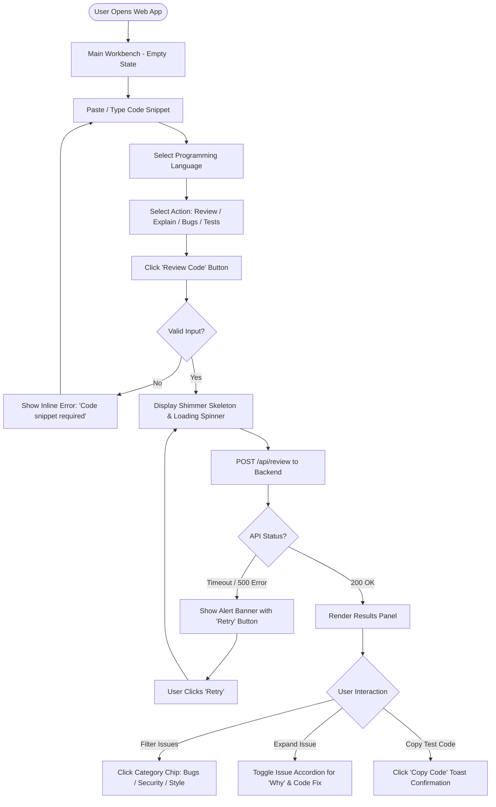

# Design Brief

## AI-Powered Code Review & Explanation Assistant

**Document Status:** Approved  
**Author:** Senior Product Designer  
**Project Alignment:** AI Code Reviewer (Spring Boot + React)  
**Target Compliance:** WCAG 2.1 AA

---

## Executive Overview & Design Philosophy

The **AI-Powered Code Review & Explanation Assistant** design system prioritizes a **developer-centric, low-friction, educational environment**. Inspired by modern IDEs and developer tools (such as GitHub, VS Code, and Linear), the interface uses a dark-mode-first aesthetic, crisp typographic hierarchy for monospaced code, and clear color-coded severity indicators.

### Key Design Principles

1. **Low Cognitive Load:** Split-screen layout keeps input code and AI results side-by-side without page redirects.
2. **Immediate Feedback:** Clear visual states (loading shimmer, animated score gauges, error banners) maintain transparency during LLM processing.
3. **Actionable & Educational:** Prioritize "Why this matters" explanations over simple error lists, helping junior developers learn best practices.

---

## 1. User Flows



### Core User Flow Descriptions

- **Flow 1: Snippet Review & Scoring (Primary Flow)**
  1. User pastes code into the editor.
  2. User selects language (default: auto-detected or last chosen) and selects action `Review`.
  3. User clicks **"Review Code"**.
  4. System shows a loading shimmer on the right results panel.
  5. API returns structured result $\rightarrow$ UI animates the overall Score Gauge (e.g. `78/100`) and lists categorized issue cards.

- **Flow 2: Code Explanation Flow**
  1. User pastes unfamiliar code snippet.
  2. User selects action `Explain`.
  3. System returns high-level summary paragraph followed by bulleted line-by-line logic breakdown.

- **Flow 3: Unit Test Generation & Copying**
  1. User pastes code snippet.
  2. User selects action `Generate Tests`.
  3. System renders a syntax-highlighted code block containing JUnit 5 / PyTest / Jest unit test boilerplate with a **"Copy Code"** button.

---

## 2. Screen Inventory

| Screen ID  | Screen Name                                 | Purpose                                                                            | Layout Type                                          |
| :--------- | :------------------------------------------ | :--------------------------------------------------------------------------------- | :--------------------------------------------------- |
| **SCR-01** | **Main Workbench (SPA)**                    | Primary workspace containing code editor, controls, and dynamic results dashboard. | Split 2-Column (Desktop) / Stacked 1-Column (Mobile) |
| **SCR-02** | **Review History Drawer** _(Phase 3)_       | Slide-out panel displaying past snippet reviews and saved scores.                  | Overlay Slide-out Drawer                             |
| **SCR-03** | **API & Model Settings Modal** _(Optional)_ | Modal dialog to configure API providers, temperature, or personal API keys.        | Centered Modal Dialog                                |

---

## 3. Layout Architecture (SCR-01 Main Workbench)

### Desktop Split-Screen Wireframe (1440px Viewport)

```
+-----------------------------------------------------------------------------------+
|  [Logo] AI Code Reviewer                  [Docs]  [GitHub Repo]  [Theme Toggle]   |
+--------------------------------------------------+--------------------------------+
|  LEFT PANEL: WORKSPACE (50%)                     | RIGHT PANEL: RESULTS (50%)     |
|                                                  |                                |
|  Language: [ Java (JDK 25)  v ]                  |  +--------------------------+  |
|  Action:   (*) Review  ( ) Explain               |  |  OVERALL QUALITY SCORE   |  |
|            ( ) Find Bugs ( ) Gen Tests           |  |          [ 82 ]            |  |
|                                                  |  |      GREAT CODE QUALITY  |  |
|  +--------------------------------------------+  |  +--------------------------+  |
|  | 1  public class Calculator {               |  |                                |
|  | 2      public int divide(int a, int b) {   |  |  Filter: [All] [Bugs (1)]      |
|  | 3          return a / b;  // potential NPE |  |          [Security (1)]        |
|  | 4      }                                   |  |                                |
|  | 5  }                                       |  |  +--------------------------+  |
|  |                                            |  |  | [!] CRITICAL: BUG       v|  |
|  |                                            |  |  | Unhandled DivisionByZero |  |
|  |                                            |  |  +--------------------------+  |
|  |                                            |  |  | [*] WARNING: SECURITY   v|  |
|  +--------------------------------------------+  |  | Missing Input Validation |  |
|  Chars: 124 / 5000         [ Clear ] [Review Code] |  +--------------------------+  |
+--------------------------------------------------+--------------------------------+
| Footer: Powered by Spring Boot & LLM API | Status: Ready                          |
+-----------------------------------------------------------------------------------+
```

---

## 4. Component Inventory (Design System Modules)

### Inputs & Controls

- `AppHeader`: Top navigation containing logo, repo link, and theme toggle.
- `LanguageSelect`: Select dropdown menu with language icons (Java, Python, JS, SQL, C++).
- `ActionRadioGroup`: Segmented control / radio group for selecting execution mode (`Review`, `Explain`, `Find Bugs`, `Generate Tests`).
- `CodeEditorInput`: Monospaced textarea wrapper with active line highlight, character counter, and line numbering.
- `PrimaryButton`: CTA button (`"Review Code"`) featuring primary brand color, hover state, focus outline, and inline loading spinner.

### Data Display & Results

- `ScoreGauge`: Animated circular SVG progress meter displaying code score (0–100) with color mapping (Red: 0–59, Yellow: 60–79, Green: 80–100).
- `CategoryFilterChips`: Interactive filter badges (`All`, `Bugs`, `Security`, `Performance`, `Style`) displaying count badges.
- `IssueAccordionCard`: Expandable card displaying:
  - Header: Severity Badge (`Critical`, `Warning`, `Info`), Category tag, Title, Line number indicator.
  - Content: Description, _Why it matters_ callout block, and _Suggested Code Fix_ snippet.
- `CodeBlockView`: Read-only syntax-highlighted code container with a single-click `"Copy"` button and toast confirmation.
- `SkeletonLoader`: Animated shimmer cards matching the height and shape of result cards during API fetching.
- `AlertBanner`: Contextual notification bar (`Error`, `Warning`, `Success`) with dismiss icon button.

---

## 5. Design Tokens

### Color Tokens

```json
{
  "color": {
    "background": {
      "canvas": { "dark": "#0D1117", "light": "#F6F8FA" },
      "surface": { "dark": "#161B22", "light": "#FFFFFF" },
      "surface-subtle": { "dark": "#21262D", "light": "#F3F4F6" }
    },
    "border": {
      "default": { "dark": "#30363D", "light": "#E5E7EB" },
      "focus": { "dark": "#58A6FF", "light": "#2563EB" }
    },
    "brand": {
      "primary": "#6366F1",
      "primary-hover": "#4F46E5",
      "primary-active": "#4338CA"
    },
    "semantic": {
      "critical": { "main": "#F85149", "bg": "rgba(248, 81, 73, 0.15)" },
      "warning": { "main": "#D29922", "bg": "rgba(210, 153, 34, 0.15)" },
      "info": { "main": "#58A6FF", "bg": "rgba(88, 166, 255, 0.15)" },
      "success": { "main": "#3FB950", "bg": "rgba(63, 185, 80, 0.15)" }
    },
    "text": {
      "primary": { "dark": "#F0F6FC", "light": "#111827" },
      "secondary": { "dark": "#8B949E", "light": "#4B5563" },
      "code": { "dark": "#E6EDE3", "light": "#1F2937" }
    }
  }
}
```

### Typography Scale

| Token Name        | Font Family               | Weight         | Size (px/rem)    | Line Height | Use Case                          |
| :---------------- | :------------------------ | :------------- | :--------------- | :---------- | :-------------------------------- |
| `font-heading-xl` | Inter, sans-serif         | Bold (700)     | 28px (1.75rem)   | 36px        | Page Title / Score Counter        |
| `font-heading-md` | Inter, sans-serif         | SemiBold (600) | 20px (1.25rem)   | 28px        | Panel Titles / Modal Headers      |
| `font-body-md`    | Inter, sans-serif         | Regular (400)  | 15px (0.9375rem) | 22px        | Standard Body Text / Descriptions |
| `font-body-sm`    | Inter, sans-serif         | Medium (500)   | 13px (0.8125rem) | 18px        | Chip Labels / Badges / Captions   |
| `font-code-md`    | JetBrains Mono, monospace | Regular (400)  | 14px (0.875rem)  | 20px        | Code Editor / Code Blocks         |

### Spacing & Elevation Scale

- **Base Unit:** 4px
- **Spacing Tokens:** `space-1` (4px), `space-2` (8px), `space-3` (12px), `space-4` (16px), `space-6` (24px), `space-8` (32px), `space-12` (48px).
- **Border Radius:**
  - `radius-sm` (4px): Badges, chips, tags.
  - `radius-md` (8px): Buttons, text inputs, dropdowns.
  - `radius-lg` (12px): Cards, code blocks, main panels.
- **Shadows / Elevation:**
  - `shadow-sm`: `0 1px 2px 0 rgba(0, 0, 0, 0.05)`
  - `shadow-md`: `0 4px 6px -1px rgba(0, 0, 0, 0.1)`

---

## 6. UI States Architecture

```
+-----------------------------------------------------------------------------------+
| 1. EMPTY STATE                                                                    |
|    Editor: Empty text area with placeholder prompt.                              |
|    Results: Graphic illustration + "Submit code to view AI quality breakdown."    |
+-----------------------------------------------------------------------------------+
| 2. LOADING STATE                                                                  |
|    Button: Disabled with spinning icon ("Analyzing Code...").                     |
|    Results: Shimmer skeleton card placeholders pulsing on right panel.            |
+-----------------------------------------------------------------------------------+
| 3. SUCCESS STATE                                                                  |
|    Results: Score gauge counts up to 82. Issue cards expand on click.              |
+-----------------------------------------------------------------------------------+
| 4. ERROR STATE                                                                    |
|    Banner: Red top notification ("Backend API timeout. Please try again.").       |
|    Button: Enabled "Retry Request" button.                                        |
+-----------------------------------------------------------------------------------+
```

---

## 7. Accessibility & Usability Notes (WCAG 2.1 AA Compliance)

### Color & Contrast Compliance

- All text tokens maintain a minimum **4.5:1 contrast ratio** against their respective backgrounds in both Dark (`#0D1117`) and Light (`#FFFFFF`) modes.
- Severity indicators (`Critical`, `Warning`, `Info`) rely on **both color and icons/text labels** (e.g. `[!] Critical`, `[*] Warning`) so colorblind users (deuteranopia/protanopia) can distinguish issue types immediately.

### Keyboard Navigation & Focus Management

- **Focus Indicator:** Visible 2px high-contrast outline (`#58A6FF` / `#2563EB`) on all interactive controls (buttons, selects, radios, accordions).
- **Tab Traversal Order:** Logical sequence:
  1. Top Header Navigation $\rightarrow$
  2. Language Dropdown $\rightarrow$
  3. Action Radio Group $\rightarrow$
  4. Code Editor Input $\rightarrow$
  5. Clear / Submit Buttons $\rightarrow$
  6. Category Filter Chips $\rightarrow$
  7. Issue Card Accordions.

### Screen Reader Support (ARIA Specifications)

- `aria-live="polite"` applied to the Results Panel container so screen readers announce when review results complete without interrupting ongoing speech.
- `aria-expanded="true|false"` and `aria-controls` explicitly bound to issue accordion toggles.
- Code containers marked with `role="region"` and `aria-label="Submitted Code Snippet"` / `aria-label="Suggested Fix Code Snippet"`.
- Submit button dynamically updates `aria-busy="true"` during LLM fetching.

---

## Summary of Deliverables & Next Steps

1. **Frontend Engineers:** Implement design tokens in Tailwind CSS config or MUI theme provider.
2. **Component Library Setup:** Build `CodeEditorInput`, `ScoreGauge`, `IssueAccordionCard`, and `SkeletonLoader`.
3. **Usability Testing:** Run screen reader audit (NVDA/VoiceOver) on accordion keyboard navigation.
