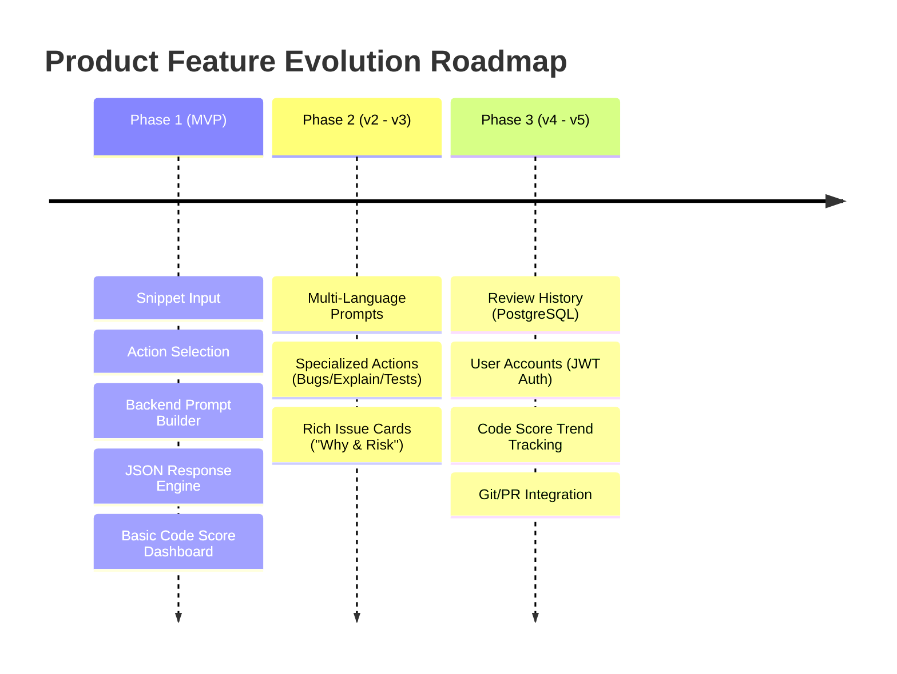
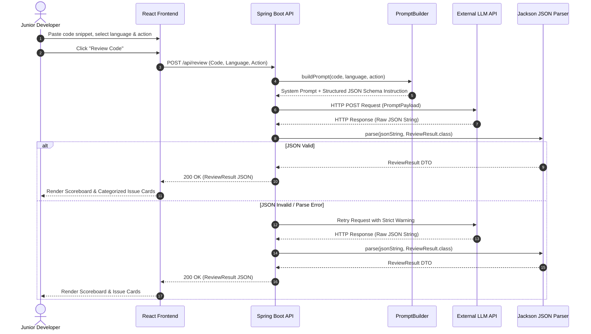

# Product Requirement Document (PRD)

## AI-Powered Code Review & Explanation Assistant

**Document Status:** Draft / Approved  
**Author:** Senior Product Manager  
**Target Delivery:** Q3 2026 (Phase 1 MVP)  
**Stack Alignment:** Java 25 / Spring Boot Backend, React Frontend, External LLM API (OpenAI/Anthropic)

---

## Executive Summary

The **AI-Powered Code Review & Explanation Assistant** is a lightweight, web-based tool designed to help beginner developers, students, and self-taught programmers analyze code, detect bugs, understand complex logic, and generate unit tests. By providing structured, immediate, and pedagogical feedback, the platform bridges the gap between raw compiler errors and human mentor guidance.

---

## 1. Problem Statement

### The Problem

Beginner developers and computer science students frequently encounter roadblock scenarios when learning programming languages like Java, Python, or JavaScript:

1. **Cryptic Compiler & Runtime Errors:** Standard error tracebacks often obscure the underlying conceptual flaw, leading to frustration and unproductive debugging loops.
2. **Lack of Instant Code Review:** Learners in bootcamps, online courses, or self-study environments rarely have access to 24/7 senior developer code reviews to evaluate code quality, style, security risks, or efficiency.
3. **Overwhelming LLM Chat Interfaces:** Generic chat interfaces (like raw ChatGPT) return unstructured markdown prose that varies wildly in tone and formatting, making it hard to programmatically parse issues, score code health, or highlight specific improvements.

### The Opportunity

By wrapping a specialized Prompt Builder and rigid JSON Schema validator around LLM calls inside a Spring Boot backend, we can provide a deterministic, structured feedback engine with an intuitive React interface tailored specifically for code learning.

---

## 2. Target User & Persona Analysis

### Primary Persona: _Junior Developer / Computer Science Student ("Alex")_

- **Background:** Learning full-stack software development (Java/Spring Boot, JavaScript/React, Python).
- **Goals:**
  - Understand _why_ code fails or runs inefficiently, not just get a copy-paste fix.
  - Receive constructive feedback on security vulnerabilities, edge cases, and code style.
  - Practice writing tests and improving code structure.
- **Pain Points:**
  - Spends hours stuck on simple logic bugs or syntax misconfigurations.
  - Struggles to understand long stack traces or official documentation.
  - Doesn't know best practices (e.g., resource leaks, SQL injection risks, null pointer safety).
- **Key Needs:**
  - Instant feedback loop (< 5s response time).
  - Categorized issue breakdown (Bugs vs. Performance vs. Security vs. Style).
  - Clear "Why this matters" explanations formatted visually.

---

## 3. User Stories & Acceptance Criteria

### US-01: Paste & Analyze Code Snippet

- **As a** junior developer,
- **I want to** paste a snippet of code into a text editor, select its language and an action (e.g., Review, Explain, Find Bugs), and submit it for analysis,
- **So that** I can get targeted feedback on my code without setting up complex IDE integrations.

> **Acceptance Criteria:**
>
> - UI provides a code input area supporting multiline code snippets up to 5,000 characters.
> - User can select from supported languages (Java, Python, JavaScript, SQL, C/C++).
> - User can select from pre-defined actions (`Review`, `Explain`, `Find Bugs`, `Generate Tests`).
> - Form submission triggers an asynchronous API call with a clear loading indicator.

---

### US-02: View Structured Code Health Feedback

- **As a** learner,
- **I want to** see my code review broken down into a numerical score, categorized issues, and actionable recommendations,
- **So that** I can quickly identify critical bugs before reviewing minor style suggestions.

> **Acceptance Criteria:**
>
> - Review output renders a overall **Code Quality Score** (0–100 scale).
> - Issues are grouped by category: `Bug`, `Security`, `Performance`, `Style/Best Practice`.
> - Each issue card displays: Title, Severity level (`Critical`, `Warning`, `Info`), Line reference (if available), Description, and Recommended Fix.

---

### US-03: Code Explanation & Concept Breakdown

- **As a** student reading unfamiliar code,
- **I want to** select the "Explain Code" action,
- **So that** the AI breaks down the logic step-by-step in plain, beginner-friendly English.

> **Acceptance Criteria:**
>
> - Selecting `Explain` returns a high-level summary followed by bulleted step-by-step logic explanations.
> - Uses plain non-jargon explanations suitable for beginners.

---

### US-04: Automated Unit Test Generation

- **As a** developer learning test-driven development,
- **I want to** generate unit tests for my input code snippet,
- **So that** I can copy unit test cases directly into my project (JUnit for Java, PyTest for Python, Jest for JS).

> **Acceptance Criteria:**
>
> - Selecting `Generate Tests` outputs executable test code formatted in a syntax-highlighted code block.
> - Includes a single-click "Copy Code" button.

---

## 4. Core Features: MVP vs. Future Roadmap



### Feature Matrix

| Feature                             | Scope   | Description                                                                                     | Phase   |
| :---------------------------------- | :------ | :---------------------------------------------------------------------------------------------- | :------ |
| **Code Snippet Input**              | MVP     | Multiline code editor supporting copy/paste & language selection                                | Phase 1 |
| **Action Selector**                 | MVP     | Radio buttons / dropdown for `Review`, `Explain`, `Find Bugs`, `Generate Tests`                 | Phase 1 |
| **Prompt Builder Engine**           | MVP     | Java backend logic that wraps input code with system prompts and rigid output instructions      | Phase 1 |
| **Structured JSON Parser**          | MVP     | Backend Jackson ObjectMapper integration to parse and validate LLM JSON DTO responses           | Phase 1 |
| **Code Health Scoreboard**          | MVP     | Frontend dashboard displaying total score (0-100) and issue count breakdown                     | Phase 1 |
| **Rich Issue Cards**                | Phase 2 | Expandable issue UI detailing _Description_, _Why it matters_, _Risk_, and _Suggested Code Fix_ | Phase 2 |
| **Unit Test Code Generator**        | Phase 2 | Language-aware test scaffolding generator (JUnit 5, PyTest, Jest) with copy button              | Phase 2 |
| **Review History & Database**       | Phase 3 | Persistence layer (PostgreSQL + Spring Data JPA) to store past reviews and snippet history      | Phase 3 |
| **Authentication & User Profiles**  | Phase 3 | User registration, login (JWT + Spring Security), and personal review history dashboard         | Phase 3 |
| **GitHub Pull Request Integration** | Future  | Webhook integration to post automated AI review comments on GitHub PR diffs                     | Future  |

---

## 5. Success Metrics & Key Performance Indicators (KPIs)

To measure success for this launch (focused on **User Engagement & Adoption**):

### Primary Acquisition & Engagement Metrics

- **Weekly Active Users (WAU):** Target of >500 active users by Month 2 post-launch.
- **Review Volume per User:** Average of >5 code review requests per active user per session.
- **Completion Rate:** >90% of submitted code review requests successfully result in rendered structured feedback without user drop-off or frontend error.

### Product Quality & Latency Metrics

- **P95 Latency:** End-to-end API response time under **4.5 seconds** for snippets up to 200 lines.
- **JSON Parse Error Rate:** < 1% of LLM calls fail JSON DTO deserialization (handled by retry fallback logic).
- **User Satisfaction / Feedback Rating:** >80% positive ("Helpful") rating on rendered review cards.

---

## 6. Edge Cases, Failure Modes & Mitigations

| Edge Case / Failure Scenario                            | Risk Level | Mitigation Strategy                                                                                                                                                                                                       |
| :------------------------------------------------------ | :--------- | :------------------------------------------------------------------------------------------------------------------------------------------------------------------------------------------------------------------------ |
| **LLM Returns Unstructured Prose or Invalid JSON**      | High       | Backend system prompt mandates `Respond ONLY with valid JSON`. If Jackson parsing fails, the backend triggers 1 immediate retried call with higher temperature penalty or cleans markdown fences (` ```json ` stripping). |
| **Code Snippet Exceeds Character Limit (>5,000 chars)** | Medium     | Frontend input validation prevents submission with clear helper text. Backend enforces request body size limits (`400 Bad Request`).                                                                                      |
| **Empty or Whitespace-Only Code Submission**            | Low        | Frontend disables submission button when text area is empty. Backend returns immediate validation error before invoking LLM API.                                                                                          |
| **LLM API Timeout or Down**                             | High       | Spring Boot REST client implements a 10-second timeout with fallback error message (`"AI Review Service is temporarily busy. Please try again in a few seconds."`).                                                       |
| **Unsupported Language or Malformed Code Input**        | Medium     | The LLM is instructed in the system prompt to return a graceful low score with an explicit note: `"Unable to parse code syntax for language X"`.                                                                          |
| **Malicious Code / Injection Prompts**                  | High       | Prompt builder sanitizes input text, escapes template variables, and isolates user code within delimiter fences (` ```code...``` `) to prevent system prompt override.                                                    |

---

## 7. Out-of-Scope (Non-Goals for Initial Releases)

To maintain a lean MVP focus, the following items are strictly **OUT OF SCOPE**:

1. **Full Repository Parsing / Multi-File Context:** MVP supports only single code snippet submissions, not entire repository zip uploads or multi-file dependencies.
2. **Automated Code Execution / Sandboxing:** The platform will **not** compile or execute the submitted user code on our servers. All feedback is static analysis powered by LLM pattern recognition.
3. **Real-time IDE Extensions:** Native VS Code or IntelliJ plugins are out of scope for Phase 1 (Web application focus only).
4. **Custom LLM Fine-Tuning / Self-Hosted Models:** No self-hosted Ollama or custom model fine-tuning; relies on standard public APIs (OpenAI GPT-4o / Anthropic Claude 3.5 Sonnet).
5. **Team Collaboration / Shared Workspaces:** Multi-user org management, team permissions, and real-time collaborative editing are deferred to enterprise releases.

---

## 8. Technical Architecture & End-to-End Data Flow



---

## Summary & Immediate Action Items

1. **Backend Team:** Implement `PromptBuilder` and Jackson DTO mapping for `ReviewResult` in Spring Boot.
2. **Frontend Team:** Build clean snippet input form with MUI / Tailwind components and loading states.
3. **QA & Product:** Verify prompt schema consistency across 20 sample buggy Java/Python snippets.
